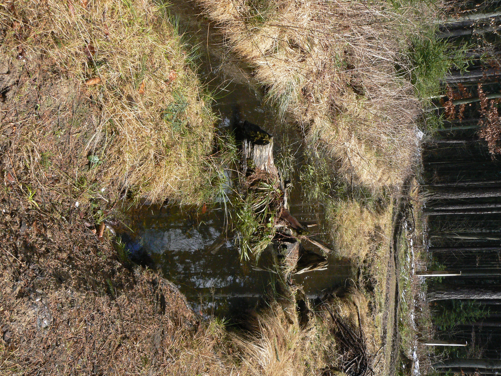

```{r setup, include=FALSE}
knitr::opts_chunk$set(echo = TRUE, warning = FALSE, message = FALSE)
knitr::opts_knit$set(root.dir = '/Volumes/sugandila/ThermHydroBehav')
```

```{r, echo=F}
library(ggplot2)
library(reshape)
library(viridis)
library(forcats)
library(cowplot)
source("./code/aux_functions.R")
```

### Study site {-}

We performed the simulation at the locality of the population from which all the physiological data was obtained: Jihlava (coordinates 16.0579, 49.2247; 600 m a. s. l.; Fig. S1.1). This is a natural population with an heterogeneous landscape where forested  (fully shaded; 90% shade in our simulations) and open patches (0% shade in our simulations) are present. Climatic and soil conditions are similar to a closeby population (Studenec) for which microclimatic data (temperature and humidity) are available. Using those data we performed a microclimate model validation that can be found in Appendix 2.

```{r, echo=FALSE, out.width = '60%', out.extra='angle=90', fig.align = 'center', fig.cap = "Picture of a breeding pond of \\textit{Ichthyosaura alpestris} and its surroundings, where forested and open microhabitats can be observed."}

```


### Thermal sensitivity of metabolic rates and acclimation capacity {-}

To determine the thermal sensitivity of standard metabolic rates (SMR), we fitted an exponential curve between metabolic rates and body temperatures using the data presented in [1] (Fig. S1.2). Podhajský and Gvoždík [2] reported a reduction in SMR of a factor ranging from 0.7 to 0.65 (ca. 30% reduction) in wild-caught newts between autumn and winter. Thus, to account for seasonal acclimation, we assumed that newts were capable of reducing SMR to 70% of its maximum value between seasons: i.e. for acclimated individuals we applied a factor of 0.7 (i.e. 70%) to the estimated SMR from the empirical Tb – SMR relationship. 

```{r, echo=F, out.width="70%", fig.align = 'center', fig.cap = "Empirical relationship between body tempèratures and standard metabolic rates (SMR) using the data presented in [1]. The solid line represents the result of the exponential curve obtained, while the dashed line is the relationship of cclimated individuals (by multiplying the exponential curve by a factor of 0.7). Note that as predicted by theory, the acclimation response reduces both the magnitude and thermal sensitivity of maintenance metabolic rate."}
## metabolic rates
mrs <- read.table('./data/Gvozdik_Kristin_AS.txt', 
                  header=T, sep='\t')
colnames(mrs) <- c('temp', 'sex', 'mass', 'smr', 'mmr', 'scope', 'fscope')


### predict smr from body temperature
smr_model <- nls(smr ~ exp(a + b * temp), data = mrs, start = list(a = 0, b = 0))
new <- data.frame(temp=seq(10,25))
new$predicted <- predict(smr_model, newdata=new)

plot(smr ~ temp, data=mrs, pch=19, cex=.5,
     xlab='Temperature (ºC)', 
     ylab=expression(paste('SMR (in mL ', O[2], ' ', h^-1, ')')))
lines(new$temp, new$predicted, lwd=2)
lines(new$temp, new$predicted * 0.7, col='gray', lty=2, lwd=2) # acclimated
```

\newpage
### Microclimatic conditions along the year {-}

```{r, echo=F, fig.cap="Simulated microclimatic conditions at full sun along the year and at different depths. a) Average, b) minimum and c) maximum temperature, and d) water potential. Note that each value represents either the mean, minimum or maximum of the whole simulated period.", fig.height=6}
# load microclimate model results 
load('./results/micro_Jihlava.Rda')
micro_current <- micro
load('./results/micro_gf85.RData')
micro_cc <- micro

soil <- data.frame(micro_current$soil)[,-3]
colnames(soil)[-c(1,2)] <- c("2.5 cm","5 cm","10 cm","15 cm","20 cm","30 cm","50 cm","100 cm","200 cm")

soilpot <- data.frame(micro_current$soilpot)[,-3]
colnames(soilpot)[-c(1,2)] <- c("2.5 cm","5 cm","10 cm","15 cm","20 cm","30 cm","50 cm","100 cm","200 cm")

mean_soil_temps <- apply(soil[,-c(1,2)], 2, function(x) tapply(x, soil$DOY, mean))
mean_soil_temps_m <- melt(mean_soil_temps)
mean_soil_temps_m$X2 <- factor(mean_soil_temps_m$X2, 
                               levels = c("2.5 cm","5 cm","10 cm","15 cm","20 cm","30 cm","50 cm","100 cm","200 cm"))

min_soil_temps <- apply(soil[,-c(1,2)], 2, function(x) tapply(x, soil$DOY, min))
min_soil_temps_m <- melt(min_soil_temps)
min_soil_temps_m$X2 <- factor(min_soil_temps_m$X2, 
                              levels = c("2.5 cm","5 cm","10 cm","15 cm","20 cm","30 cm","50 cm","100 cm","200 cm"))

max_soil_temps <- apply(soil[,-c(1,2)], 2, function(x) tapply(x, soil$DOY, max))
max_soil_temps_m <- melt(max_soil_temps)
max_soil_temps_m$X2 <- factor(max_soil_temps_m$X2, 
                              levels = c("2.5 cm","5 cm","10 cm","15 cm","20 cm","30 cm","50 cm","100 cm","200 cm"))

mean_soilpot <- apply(soilpot[,-c(1,2)], 2, function(x) tapply(x, soilpot$DOY, mean))
mean_soilpot_m <- melt(mean_soilpot)
mean_soilpot_m$X2 <- factor(mean_soilpot_m$X2, 
                            levels = c("2.5 cm","5 cm","10 cm","15 cm","20 cm","30 cm","50 cm","100 cm","200 cm"))
#mean_soilpot_m$value[mean_soilpot_m$value < -72.5] <- NA

p_soiltemp <- ggplot(mean_soil_temps_m, aes(x = X1, y = fct_rev(X2))) + 
  geom_tile(aes(fill = value)) +
  scale_fill_gradient2(
    low = 'deepskyblue3', mid = 'darkseagreen2', high = 'brown1',
    limits=c(-20, 65),
    midpoint = 0, guide = 'colourbar', aesthetics = 'fill',
    name = 'Temperature (in ºC)'
  ) + 
  ylab('Depth') +
  theme_minimal() +
  theme(legend.title = element_text(size = 8), legend.text = element_text(size = 7),
        axis.title.x=element_blank(),
        legend.position="right", legend.key.height=unit(.4,"cm"), legend.key.width=unit(.2,"cm"))

p_minsoiltemp <- ggplot(min_soil_temps_m, aes(x = X1, y = fct_rev(X2))) + 
  geom_tile(aes(fill = value)) +
  scale_fill_gradient2(
    low = 'deepskyblue3', mid = 'darkseagreen2', high = 'brown1',
    limits=c(-20, 65),
    midpoint = 0, guide = 'colourbar', aesthetics = 'fill',
    name = 'Temperature (in ºC)'
  ) + 
  ylab('Depth') +
  theme_minimal() +
  theme(legend.title = element_text(size = 8), legend.text = element_text(size = 7),
        axis.title.x=element_blank(),
        legend.position="right", legend.key.height=unit(.4,"cm"), legend.key.width=unit(.2,"cm"))

p_maxsoiltemp <- ggplot(max_soil_temps_m, aes(x = X1, y = fct_rev(X2))) + 
  geom_tile(aes(fill = value)) +
  scale_fill_gradient2(
    low = 'deepskyblue3', mid = 'darkseagreen2', high = 'brown1',
    limits=c(-20, 65),
    midpoint = 0, guide = 'colourbar', aesthetics = 'fill',
    name = 'Temperature (in ºC)'
  ) + 
  ylab('Depth') +
  theme_minimal() +
  theme(legend.title = element_text(size = 8), legend.text = element_text(size = 7),
        axis.title.x=element_blank(),
        legend.position="right", legend.key.height=unit(.4,"cm"), legend.key.width=unit(.2,"cm"))

p_soilpot <- ggplot(mean_soilpot_m, aes(x = X1, y = fct_rev(X2))) + 
  geom_tile(aes(fill = value)) +
  scale_fill_viridis(option = "E", direction = -1, name = expression(paste('Potential (J ', kg^-1, ')'))) + 
  xlab('Day of the year') + 
  ylab('Depth') +
  theme_minimal() +
  theme(legend.title = element_text(size = 8), legend.text = element_text(size = 7),
        legend.position="right", legend.key.height=unit(.4,"cm"), legend.key.width=unit(.2,"cm"))


plot_env <- plot_grid(NULL, p_soiltemp, p_minsoiltemp, p_maxsoiltemp, p_soilpot,
                      rel_heights = c(0.1, 1, 1, 1, 1),
                      labels = c("", "a", "b", "c", "d"),
                      vjust = 0.1,
                      label_size = 16, ncol = 1, nrow = 5, align='hv')
plot_env
```


```{r, echo=F, fig.cap="Simulated microclimatic conditions at deep (90%) shade along the year and at different depths. a) Average, b) minimum and c) maximum temperature, and d) water potential. Note that each value represents either the mean, minimum or maximum of the whole simulated period.", fig.height=6}

soil_sh <- data.frame(micro_current$shadsoil)[,-3]
colnames(soil_sh)[-c(1,2)] <- c("2.5 cm","5 cm","10 cm","15 cm","20 cm","30 cm","50 cm","100 cm","200 cm")

soilpot_sh <- data.frame(micro_current$shadpot)[,-3]
colnames(soilpot_sh)[-c(1,2)] <- c("2.5 cm","5 cm","10 cm","15 cm","20 cm","30 cm","50 cm","100 cm","200 cm")

mean_soil_temps_sh <- apply(soil_sh[,-c(1,2)], 2, function(x) tapply(x, soil_sh$DOY, mean))
mean_soil_temps_sh_m <- melt(mean_soil_temps_sh)
mean_soil_temps_sh_m$X2 <- factor(mean_soil_temps_sh_m$X2, 
                                  levels = c("2.5 cm","5 cm","10 cm","15 cm","20 cm","30 cm","50 cm","100 cm","200 cm"))

min_soil_temps_sh <- apply(soil_sh[,-c(1,2)], 2, function(x) tapply(x, soil_sh$DOY, min))
min_soil_temps_sh_m <- melt(min_soil_temps_sh)
min_soil_temps_sh_m$X2 <- factor(min_soil_temps_sh_m$X2, 
                                 levels = c("2.5 cm","5 cm","10 cm","15 cm","20 cm","30 cm","50 cm","100 cm","200 cm"))

max_soil_temps_sh <- apply(soil_sh[,-c(1,2)], 2, function(x) tapply(x, soil_sh$DOY, max))
max_soil_temps_sh_m <- melt(max_soil_temps_sh)
max_soil_temps_sh_m$X2 <- factor(max_soil_temps_sh_m$X2, 
                                 levels = c("2.5 cm","5 cm","10 cm","15 cm","20 cm","30 cm","50 cm","100 cm","200 cm"))

mean_soilpot_sh <- apply(soilpot_sh[,-c(1,2)], 2, function(x) tapply(x, soilpot_sh$DOY, mean))
mean_soilpot_sh_m <- melt(mean_soilpot_sh)
mean_soilpot_sh_m$X2 <- factor(mean_soilpot_sh_m$X2, 
                               levels = c("2.5 cm","5 cm","10 cm","15 cm","20 cm","30 cm","50 cm","100 cm","200 cm"))
#mean_soilpot_m$value[mean_soilpot_m$value < -72.5] <- NA

p_soiltemp <- ggplot(mean_soil_temps_sh_m, aes(x = X1, y = fct_rev(X2))) + 
  geom_tile(aes(fill = value)) +
  scale_fill_gradient2(
    low = 'deepskyblue3', mid = 'darkseagreen2', high = 'brown1',
    limits=c(-20, 65),
    midpoint = 0, guide = 'colourbar', aesthetics = 'fill',
    name = 'Temperature (in ºC)'
  ) + 
  ylab('Depth') +
  theme_minimal() +
  theme(legend.title = element_text(size = 8), legend.text = element_text(size = 7),
        axis.title.x=element_blank(),
        legend.position="right", legend.key.height=unit(.4,"cm"), legend.key.width=unit(.2,"cm"))

p_minsoiltemp <- ggplot(min_soil_temps_sh_m, aes(x = X1, y = fct_rev(X2))) + 
  geom_tile(aes(fill = value)) +
  scale_fill_gradient2(
    low = 'deepskyblue3', mid = 'darkseagreen2', high = 'brown1',
    limits=c(-20, 65),
    midpoint = 0, guide = 'colourbar', aesthetics = 'fill',
    name = 'Temperature (in ºC)'
  ) + 
  ylab('Depth') +
  theme_minimal() +
  theme(legend.title = element_text(size = 8), legend.text = element_text(size = 7),
        axis.title.x=element_blank(),
        legend.position="right", legend.key.height=unit(.4,"cm"), legend.key.width=unit(.2,"cm"))

p_maxsoiltemp <- ggplot(max_soil_temps_sh_m, aes(x = X1, y = fct_rev(X2))) + 
  geom_tile(aes(fill = value)) +
  scale_fill_gradient2(
    low = 'deepskyblue3', mid = 'darkseagreen2', high = 'brown1',
    limits=c(-20, 65),
    midpoint = 0, guide = 'colourbar', aesthetics = 'fill',
    name = 'Temperature (in ºC)'
  ) + 
  ylab('Depth') +
  theme_minimal() +
  theme(legend.title = element_text(size = 8), legend.text = element_text(size = 7),
        axis.title.x=element_blank(),
        legend.position="right", legend.key.height=unit(.4,"cm"), legend.key.width=unit(.2,"cm"))

p_soilpot <- ggplot(mean_soilpot_sh_m, aes(x = X1, y = fct_rev(X2))) + 
  geom_tile(aes(fill = value)) +
  scale_fill_viridis(option = "E", direction = -1, name = expression(paste('Potential (J ', kg^-1, ')'))) + 
  xlab('Day of the year') + 
  ylab('Depth') +
  theme_minimal() +
  theme(legend.title = element_text(size = 8), legend.text = element_text(size = 7),
        legend.position="right", legend.key.height=unit(.4,"cm"), legend.key.width=unit(.2,"cm"))


plot_env <- plot_grid(NULL, p_soiltemp, p_minsoiltemp, p_maxsoiltemp, p_soilpot,
                      rel_heights = c(0.1, 1, 1, 1, 1),
                      labels = c("", "a", "b", "c", "d"),
                      vjust = 0.1,
                      label_size = 16, ncol = 1, nrow = 5, align='hv')
plot_env
```

\newpage
### Climate change scenarios and associated changes in microclimates {-}


```{r, echo=F, fig.cap="Offsets of (a) temperature and (b) precipitation for each month as calculated by subtracting values under the current climate and different climate change scenarios. Climate change scenarios correspond to 'cc45': CCSM4 RCP 4.5; 'cc85': CCSM4 RCP 8.5; 'gf45': GFDL-CM3 RCP 4.5; 'gf85': GFDL-CM3 RCP 8.5; 'hg45': HadGEM2-CC RCP 4.5; and 'hg85': HadGEM2-CC RCP 8.5.", fig.height=2.5}
load("./data/offsets.RData")
temp_offsets <- data.frame(month = 1:12, cc45 = t(unname(offsets[[1]]$temp_offset)))
prec_offsets <- data.frame(month = 1:12, cc45 = t(unname(offsets[[1]]$prec_offset)))
for(i in names(offsets)[-1]){
  temp_offsets$new <- t(unname(offsets[[i]]$temp_offset))
  colnames(temp_offsets)[which(colnames(temp_offsets) == 'new')] <- i
  
  prec_offsets$new <- t(unname(offsets[[i]]$prec_offset))
  colnames(prec_offsets)[which(colnames(prec_offsets) == 'new')] <- i
}

df_t_offs <- melt(temp_offsets, id.vars = "month")
df_p_offs <- melt(prec_offsets, id.vars = "month")

p_t_offs <- ggplot(df_t_offs, aes(x = month, y = value, color = variable)) +
  geom_line() +
  theme_bw() +
  scale_x_continuous(breaks= 1:12) +
  labs(y = "temperature offset (ºC)")

p_p_offs <- ggplot(df_p_offs, aes(x = month, y = value, color = variable)) +
  geom_line() + 
  geom_hline(yintercept=0, linetype='dashed') +
  theme_bw() +
  scale_x_continuous(breaks= 1:12) +
  labs(y = "precipitation offset (mm)")

plot_env <- plot_grid(p_t_offs, p_p_offs,
                      labels = c("a", "b"),
                      label_size = 16, ncol = 2, nrow = 1, align='hv')
plot_env
```


```{r, echo=F, fig.cap="Simulated change in microclimatic conditions at full sun (0% shade) along the year and at different depths given the harshest climate change scenario (GFDL-CM3 – RCP 8.5). a) Average, b) minimum and c) maximum temperature, and d) water potential. Note that each value represents either the mean, minimum or maximum of the whole simulated period. Regarding water potential, the gray area represents the periods with dryer conditions while coloured areas represent either the same moisture than under the current climate (values equal to 1) or moister conditions (values < 1)", fig.height=6}
soil_cc <- data.frame(micro_cc$soil)[,-3]
colnames(soil_cc)[-c(1,2)] <- c("2.5 cm","5 cm","10 cm","15 cm","20 cm","30 cm","50 cm","100 cm","200 cm")

soil_ccpot <- data.frame(micro_cc$soilpot)[,-3]
colnames(soil_ccpot)[-c(1,2)] <- c("2.5 cm","5 cm","10 cm","15 cm","20 cm","30 cm","50 cm","100 cm","200 cm")

mean_soil_cc_temps <- apply(soil_cc[,-c(1,2)], 2, function(x) tapply(x, soil_cc$DOY, mean))
mean_soil_cc_temps_m <- melt(mean_soil_cc_temps)
mean_soil_cc_temps_m$X2 <- factor(mean_soil_cc_temps_m$X2, 
                                  levels = c("2.5 cm","5 cm","10 cm","15 cm","20 cm","30 cm","50 cm","100 cm","200 cm"))

min_soil_cc_temps <- apply(soil_cc[,-c(1,2)], 2, function(x) tapply(x, soil_cc$DOY, min))
min_soil_cc_temps_m <- melt(min_soil_cc_temps)
min_soil_cc_temps_m$X2 <- factor(min_soil_cc_temps_m$X2, 
                                 levels = c("2.5 cm","5 cm","10 cm","15 cm","20 cm","30 cm","50 cm","100 cm","200 cm"))

max_soil_cc_temps <- apply(soil_cc[,-c(1,2)], 2, function(x) tapply(x, soil_cc$DOY, max))
max_soil_cc_temps_m <- melt(max_soil_cc_temps)
max_soil_cc_temps_m$X2 <- factor(max_soil_cc_temps_m$X2, 
                                 levels = c("2.5 cm","5 cm","10 cm","15 cm","20 cm","30 cm","50 cm","100 cm","200 cm"))

mean_soil_ccpot <- apply(soil_ccpot[,-c(1,2)], 2, function(x) tapply(x, soil_ccpot$DOY, mean))
mean_soil_ccpot_m <- melt(mean_soil_ccpot)
mean_soil_ccpot_m$X2 <- factor(mean_soil_ccpot_m$X2, 
                               levels = c("2.5 cm","5 cm","10 cm","15 cm","20 cm","30 cm","50 cm","100 cm","200 cm"))

dif_mean_soil_cc_temps_m <- mean_soil_cc_temps_m
dif_min_soil_cc_temps_m <- min_soil_cc_temps_m
dif_max_soil_cc_temps_m <- max_soil_cc_temps_m
dif_mean_soil_ccpot_m <- mean_soil_ccpot_m

dif_mean_soil_cc_temps_m$value <- mean_soil_cc_temps_m$value - mean_soil_temps_m$value
dif_min_soil_cc_temps_m$value <- min_soil_cc_temps_m$value - min_soil_temps_m$value
dif_max_soil_cc_temps_m$value <- max_soil_cc_temps_m$value - max_soil_temps_m$value
dif_mean_soil_ccpot_m$value <- mean_soil_ccpot_m$value / mean_soilpot_m$value
#dif_mean_soil_ccpot_m$value[dif_mean_soil_ccpot_m$value > 1] <- NA

p_soiltemp <- ggplot(dif_mean_soil_cc_temps_m, aes(x = X1, y = fct_rev(X2))) + 
  geom_tile(aes(fill = value)) +
  scale_fill_gradient2(
    low = 'deepskyblue3', mid = 'darkseagreen2', high = 'brown1',
    #limits=c(-20, 65),
    midpoint = 0, guide = 'colourbar', aesthetics = 'fill',
    name = 'Temperature (in ºC)'
  ) + 
  ylab('Depth') +
  theme_minimal() +
  theme(legend.title = element_text(size = 8), legend.text = element_text(size = 7),
        axis.title.x=element_blank(),
        legend.position="right", legend.key.height=unit(.4,"cm"), legend.key.width=unit(.2,"cm"))

p_minsoiltemp <- ggplot(dif_min_soil_cc_temps_m, aes(x = X1, y = fct_rev(X2))) + 
  geom_tile(aes(fill = value)) +
  scale_fill_gradient2(
    low = 'deepskyblue3', mid = 'darkseagreen2', high = 'brown1',
    #limits=c(-20, 65),
    midpoint = 0, guide = 'colourbar', aesthetics = 'fill',
    name = 'Temperature (in ºC)'
  ) + 
  ylab('Depth') +
  theme_minimal() +
  theme(legend.title = element_text(size = 8), legend.text = element_text(size = 7),
        axis.title.x=element_blank(),
        legend.position="right", legend.key.height=unit(.4,"cm"), legend.key.width=unit(.2,"cm"))

p_maxsoiltemp <- ggplot(dif_max_soil_cc_temps_m, aes(x = X1, y = fct_rev(X2))) + 
  geom_tile(aes(fill = value)) +
  scale_fill_gradient2(
    low = 'deepskyblue3', mid = 'darkseagreen2', high = 'brown1',
    #limits=c(-20, 65),
    midpoint = 0, guide = 'colourbar', aesthetics = 'fill',
    name = 'Temperature (in ºC)'
  ) + 
  ylab('Depth') +
  theme_minimal() +
  theme(legend.title = element_text(size = 8), legend.text = element_text(size = 7),
        axis.title.x=element_blank(),
        legend.position="right", legend.key.height=unit(.4,"cm"), legend.key.width=unit(.2,"cm"))

p_soilpot <- ggplot(dif_mean_soil_ccpot_m, aes(x = X1, y = fct_rev(X2))) + 
  geom_tile(aes(fill = value)) +
  scale_fill_gradient2(
    low = 'deepskyblue3', mid = 'darkseagreen2', high = 'brown1',
    limits=c(0, 1),
    midpoint = 1, guide = 'colourbar', aesthetics = 'fill',
    name = expression(paste('Potential (J ', kg^-1, ')'))
  ) + 
  xlab('Day of the year') + 
  ylab('Depth') +
  theme_minimal() +
  theme(legend.title = element_text(size = 8), legend.text = element_text(size = 7),
        legend.position="right", legend.key.height=unit(.4,"cm"), legend.key.width=unit(.2,"cm"))

plot_env <- plot_grid(NULL, p_soiltemp, p_minsoiltemp, p_maxsoiltemp, p_soilpot,
                      rel_heights = c(0.1, 1, 1, 1, 1),
                      labels = c("", "a", "b", "c", "d"),
                      vjust = 0.1,
                      label_size = 16, ncol = 1, nrow = 5, align='hv')
plot_env
```

\newpage
### Additional results: selected depths with vertical movement restrictions {-}

```{r, echo=F, fig.cap="Simulated retreat depths (cm below ground) with vertical movement restrictions (up to 50 cm) of a model ectotherm (terrestrial newt) using various thermo- and hydroregulatory strategies (a-d) in winter and (e-h) in summer under current climate conditions (first column) and under different climate change scenarios (second column). The width of each violin indicates relative time spent at a given depth. Data plotted with transparency shows the uncertainty associated to different climate change scenarios (see Material and Methods in the main text for details on the scenarios considered).", fig.height=7}

# load ectotherm model results for the present and subset winter and summer
# at full sun
ec_cur_sun_50cm <- load_ectos(path = "./results",
                              scenario = "current",
                              movement = "50cm",
                              shading = "sun",
                              micro = micro)

ec_cur_sun_50cm_summer <- subset_env(ec_cur_sun_50cm, season = "summer")
ec_cur_sun_50cm_winter <- subset_env(ec_cur_sun_50cm, season = "winter")

# at deep shade
ec_cur_shade_50cm <- load_ectos(path = "./results",
                                scenario = "current",
                                movement = "50cm",
                                shading = "shade",
                                micro = micro)

ec_cur_shade_50cm_summer <- subset_env(ec_cur_shade_50cm, season = "summer")
ec_cur_shade_50cm_winter <- subset_env(ec_cur_shade_50cm, season = "winter")


# DEPTH PLOTS: 

# Selected depths given different behaviors (with movement restriction)
# at full sun

list_ec_cur_sun_50cm_winter <- list(ec_cur_sun_50cm_winter)
list_ec_cur_sun_50cm_summer <- list(ec_cur_sun_50cm_summer)
list_cc_sun_50cm_winter <- list()
list_cc_sun_50cm_summer <- list()
scen <- c('cc45', 'cc85', 'gf45', 'gf85', 'hg45', 'hg85')
for(s in scen){
  ec_cc_sun_50cm <- load_ectos(path = "./results",
                               scenario = s,
                               movement = "50cm",
                               shading = "sun",
                               micro = micro)
  ec_cc_sun_50cm$model <- as.factor(substr(ec_cc_sun_50cm$model, 1, nchar(as.character(ec_cc_sun_50cm$model))-5)) # set the same name to plot them stacked
  ec_cc_sun_50cm_summer <- subset_env(ec_cc_sun_50cm, season = "summer")
  ec_cc_sun_50cm_winter <- subset_env(ec_cc_sun_50cm, season = "winter")
  list_cc_sun_50cm_summer[[s]] <- ec_cc_sun_50cm_summer
  list_cc_sun_50cm_winter[[s]] <- ec_cc_sun_50cm_winter
}

depth_p3 <- plot_depth(list_ec_cur_sun_50cm_winter, title = 'Current climate', subtitle='Winter - sun', labels='no')
depth_p4 <- plot_depth(list_cc_sun_50cm_winter, title = '2070', subtitle='Winter - sun', labels='no', ylab='')
depth_p7 <- plot_depth(list_ec_cur_sun_50cm_summer, subtitle='Summer - sun', labels='no')
depth_p8 <- plot_depth(list_cc_sun_50cm_summer, subtitle='Summer - sun', labels='no', ylab='')

# at deep shade

list_ec_cur_shade_50cm_winter <- list(ec_cur_shade_50cm_winter)
list_ec_cur_shade_50cm_summer <- list(ec_cur_shade_50cm_summer)
list_cc_shade_50cm_winter <- list()
list_cc_shade_50cm_summer <- list()
scen <- c('cc45', 'cc85', 'gf45', 'gf85', 'hg45', 'hg85')
for(s in scen){
  ec_cc_shade_50cm <- load_ectos(path = "./results",
                                 scenario = s,
                                 movement = "50cm",
                                 shading = "shade",
                                 micro = micro)
  ec_cc_shade_50cm$model <- as.factor(substr(ec_cc_shade_50cm$model, 1, nchar(as.character(ec_cc_shade_50cm$model))-5)) # set the same name to plot them stacked
  ec_cc_shade_50cm_summer <- subset_env(ec_cc_shade_50cm, season = "summer")
  ec_cc_shade_50cm_winter <- subset_env(ec_cc_shade_50cm, season = "winter")
  list_cc_shade_50cm_summer[[s]] <- ec_cc_shade_50cm_summer
  list_cc_shade_50cm_winter[[s]] <- ec_cc_shade_50cm_winter
}

depth_p2.3 <- plot_depth(list_ec_cur_shade_50cm_winter, subtitle='Winter - shade', labels='no', ylab='')
depth_p2.4 <- plot_depth(list_cc_shade_50cm_winter, subtitle='Winter - shade', labels='no', ylab='')
depth_p2.7 <- plot_depth(list_ec_cur_shade_50cm_summer, subtitle='Summer - shade', labels='yes', ylab='')
depth_p2.8 <- plot_depth(list_cc_shade_50cm_summer, subtitle='Summer - shade', labels='yes', ylab='')

plot_all_depths <- plot_grid(depth_p3, depth_p4, 
                             depth_p2.3, depth_p2.4, 
                             depth_p7, depth_p8, 
                             depth_p2.7, depth_p2.8, 
                             labels=c("a", "b", "c", "d", 
                                      "e", "f", "g", "h"),
                             label_size = 18, ncol = 2, nrow = 4, align='v')
# FIX LABELS!!!!
plot_all_depths
```

\newpage
### Additional results: Energy use changes under different climate change scenarios {-}

```{r, echo=F, fig.cap="Simulated cumulative mandatory energy (SMR) use change of various thermo- and hydroregulatory strategies, with or without acclimation of SMR, with respect to the same strategy under the current climate in a model ectotherm (terrestrial newt) hidden in a burrow, under CCSM4 RCP 8.5. Individuals were simulated adopting strategies involving vertical movements in the substrate up to 2 m (a-d) and up to 50 cm (e-h) during winter (a-b, e-f) and summer (c-d, g-h). Note that the depicted cumulative energy use change represents the total change during the whole simulated period (i.e. all summer or winter hours in the simulation)."}
# both at sun and deep shade SUBSET of panels
# load ectotherm model results for the present and subset winter and summer
# at full sun
ec_cur_sun_200cm <- load_ectos(path = "./results",
                               scenario = "current",
                               movement = "200cm",
                               shading = "sun",
                               micro = micro)

ec_cur_sun_200cm_summer <- subset_env(ec_cur_sun_200cm, season = "summer")
ec_cur_sun_200cm_winter <- subset_env(ec_cur_sun_200cm, season = "winter")

# at deep shade
ec_cur_shade_200cm <- load_ectos(path = "./results",
                                 scenario = "current",
                                 movement = "200cm",
                                 shading = "shade",
                                 micro = micro)

ec_cur_shade_200cm_summer <- subset_env(ec_cur_shade_200cm, season = "summer")
ec_cur_shade_200cm_winter <- subset_env(ec_cur_shade_200cm, season = "winter")


ec_cc_sun_200cm <- load_ectos(path = "./results",
                              scenario = "cc85",
                              movement = "200cm",
                              shading = "sun",
                              micro = micro)
ec_cc_sun_50cm <- load_ectos(path = "./results",
                             scenario = "cc85",
                             movement = "50cm",
                             shading = "sun",
                             micro = micro)
ec_cc_shade_200cm <- load_ectos(path = "./results",
                                scenario = "cc85",
                                movement = "200cm",
                                shading = "shade",
                                micro = micro)
ec_cc_shade_50cm <- load_ectos(path = "./results",
                               scenario = "cc85",
                               movement = "50cm",
                               shading = "shade",
                               micro = micro)

delta_p1 <- plot_delta_smr(ec_cur_sun_200cm, ec_cc_sun_200cm, period='winter', title="Sun")
delta_p2 <- plot_delta_smr(ec_cur_shade_200cm, ec_cc_shade_200cm, period='winter', title="Shade", ylab='')
delta_p3 <- plot_delta_smr(ec_cur_sun_200cm, ec_cc_sun_200cm, period='summer', title="Sun", ylab='')
delta_p4 <- plot_delta_smr(ec_cur_shade_200cm, ec_cc_shade_200cm, period='summer', title="Shade", ylab='')
delta_p5 <- plot_delta_smr(ec_cur_sun_50cm, ec_cc_sun_50cm, period='winter', title="Sun", xlab='hour of simulation')
delta_p6 <- plot_delta_smr(ec_cur_shade_50cm, ec_cc_shade_50cm, period='winter', title="Shade", ylab='', xlab='hour of simulation')
delta_p7 <- plot_delta_smr(ec_cur_sun_50cm, ec_cc_sun_50cm, period='summer', title="Sun", ylab='', xlab='hour of simulation')
delta_p8 <- plot_delta_smr(ec_cur_shade_50cm, ec_cc_shade_50cm, period='summer', title="Shade", ylab='', xlab='hour of simulation')

plot_all_delta_smr <- plot_grid(delta_p1, delta_p2, delta_p3, delta_p4,
                                delta_p5, delta_p6, delta_p7, delta_p8,
                                labels=c("a", "b", "c", "d", 
                                         "e", "f", "g", "h"),
                                label_size = 18, ncol = 4, nrow = 2, align='hv')
title <- ggdraw() + draw_label("cc85", fontface='bold')
plot_all_delta_smr <- plot_grid(title, plot_all_delta_smr, ncol=1, rel_heights=c(0.1, 1))

plot_all_delta_smr
```

```{r, echo=F, fig.cap="Simulated cumulative mandatory energy (SMR) use change of various thermo- and hydroregulatory strategies, with or without acclimation of SMR, with respect to the same strategy under the current climate in a model ectotherm (terrestrial newt) hidden in a burrow, under GFDL-CM3 RCP 4.5. Individuals were simulated adopting strategies involving vertical movements in the substrate up to 2 m (a-d) and up to 50 cm (e-h) during winter (a-b, e-f) and summer (c-d, g-h). Note that the depicted cumulative energy use change represents the total change during the whole simulated period (i.e. all summer or winter hours in the simulation)."}
ec_cc_sun_200cm <- load_ectos(path = "./results",
                              scenario = "gf45",
                              movement = "200cm",
                              shading = "sun",
                              micro = micro)
ec_cc_sun_50cm <- load_ectos(path = "./results",
                             scenario = "gf45",
                             movement = "50cm",
                             shading = "sun",
                             micro = micro)
ec_cc_shade_200cm <- load_ectos(path = "./results",
                                scenario = "gf45",
                                movement = "200cm",
                                shading = "shade",
                                micro = micro)
ec_cc_shade_50cm <- load_ectos(path = "./results",
                               scenario = "gf45",
                               movement = "50cm",
                               shading = "shade",
                               micro = micro)

delta_p1 <- plot_delta_smr(ec_cur_sun_200cm, ec_cc_sun_200cm, period='winter', title="Sun")
delta_p2 <- plot_delta_smr(ec_cur_shade_200cm, ec_cc_shade_200cm, period='winter', title="Shade", ylab='')
delta_p3 <- plot_delta_smr(ec_cur_sun_200cm, ec_cc_sun_200cm, period='summer', title="Sun", ylab='')
delta_p4 <- plot_delta_smr(ec_cur_shade_200cm, ec_cc_shade_200cm, period='summer', title="Shade", ylab='')
delta_p5 <- plot_delta_smr(ec_cur_sun_50cm, ec_cc_sun_50cm, period='winter', title="Sun", xlab='hour of simulation')
delta_p6 <- plot_delta_smr(ec_cur_shade_50cm, ec_cc_shade_50cm, period='winter', title="Shade", ylab='', xlab='hour of simulation')
delta_p7 <- plot_delta_smr(ec_cur_sun_50cm, ec_cc_sun_50cm, period='summer', title="Sun", ylab='', xlab='hour of simulation')
delta_p8 <- plot_delta_smr(ec_cur_shade_50cm, ec_cc_shade_50cm, period='summer', title="Shade", ylab='', xlab='hour of simulation')

plot_all_delta_smr <- plot_grid(delta_p1, delta_p2, delta_p3, delta_p4,
                                delta_p5, delta_p6, delta_p7, delta_p8,
                                labels=c("a", "b", "c", "d", 
                                         "e", "f", "g", "h"),
                                label_size = 18, ncol = 4, nrow = 2, align='hv')
title <- ggdraw() + draw_label("gf45", fontface='bold')
plot_all_delta_smr <- plot_grid(title, plot_all_delta_smr, ncol=1, rel_heights=c(0.1, 1))

plot_all_delta_smr
```


```{r, echo=F, fig.cap="Simulated cumulative mandatory energy (SMR) use change of various thermo- and hydroregulatory strategies, with or without acclimation of SMR, with respect to the same strategy under the current climate in a model ectotherm (terrestrial newt) hidden in a burrow, under GFDL-CM3 RCP 8.5. Individuals were simulated adopting strategies involving vertical movements in the substrate up to 2 m (a-d) and up to 50 cm (e-h) during winter (a-b, e-f) and summer (c-d, g-h). Note that the depicted cumulative energy use change represents the total change during the whole simulated period (i.e. all summer or winter hours in the simulation)."}
ec_cc_sun_200cm <- load_ectos(path = "./results",
                              scenario = "gf85",
                              movement = "200cm",
                              shading = "sun",
                              micro = micro)
ec_cc_sun_50cm <- load_ectos(path = "./results",
                             scenario = "gf85",
                             movement = "50cm",
                             shading = "sun",
                             micro = micro)
ec_cc_shade_200cm <- load_ectos(path = "./results",
                                scenario = "gf85",
                                movement = "200cm",
                                shading = "shade",
                                micro = micro)
ec_cc_shade_50cm <- load_ectos(path = "./results",
                               scenario = "gf85",
                               movement = "50cm",
                               shading = "shade",
                               micro = micro)

delta_p1 <- plot_delta_smr(ec_cur_sun_200cm, ec_cc_sun_200cm, period='winter', title="Sun")
delta_p2 <- plot_delta_smr(ec_cur_shade_200cm, ec_cc_shade_200cm, period='winter', title="Shade", ylab='')
delta_p3 <- plot_delta_smr(ec_cur_sun_200cm, ec_cc_sun_200cm, period='summer', title="Sun", ylab='')
delta_p4 <- plot_delta_smr(ec_cur_shade_200cm, ec_cc_shade_200cm, period='summer', title="Shade", ylab='')
delta_p5 <- plot_delta_smr(ec_cur_sun_50cm, ec_cc_sun_50cm, period='winter', title="Sun", xlab='hour of simulation')
delta_p6 <- plot_delta_smr(ec_cur_shade_50cm, ec_cc_shade_50cm, period='winter', title="Shade", ylab='', xlab='hour of simulation')
delta_p7 <- plot_delta_smr(ec_cur_sun_50cm, ec_cc_sun_50cm, period='summer', title="Sun", ylab='', xlab='hour of simulation')
delta_p8 <- plot_delta_smr(ec_cur_shade_50cm, ec_cc_shade_50cm, period='summer', title="Shade", ylab='', xlab='hour of simulation')

plot_all_delta_smr <- plot_grid(delta_p1, delta_p2, delta_p3, delta_p4,
                                delta_p5, delta_p6, delta_p7, delta_p8,
                                labels=c("a", "b", "c", "d", 
                                         "e", "f", "g", "h"),
                                label_size = 18, ncol = 4, nrow = 2, align='hv')
title <- ggdraw() + draw_label("gf85", fontface='bold')
plot_all_delta_smr <- plot_grid(title, plot_all_delta_smr, ncol=1, rel_heights=c(0.1, 1))

plot_all_delta_smr
```


```{r, echo=F, fig.cap="Simulated cumulative mandatory energy (SMR) use change of various thermo- and hydroregulatory strategies, with or without acclimation of SMR, with respect to the same strategy under the current climate in a model ectotherm (terrestrial newt) hidden in a burrow, under HadGEM2-CC RCP 4.5. Individuals were simulated adopting strategies involving vertical movements in the substrate up to 2 m (a-d) and up to 50 cm (e-h) during winter (a-b, e-f) and summer (c-d, g-h). Note that the depicted cumulative energy use change represents the total change during the whole simulated period (i.e. all summer or winter hours in the simulation)."}
ec_cc_sun_200cm <- load_ectos(path = "./results",
                              scenario = "hg45",
                              movement = "200cm",
                              shading = "sun",
                              micro = micro)
ec_cc_sun_50cm <- load_ectos(path = "./results",
                             scenario = "hg45",
                             movement = "50cm",
                             shading = "sun",
                             micro = micro)
ec_cc_shade_200cm <- load_ectos(path = "./results",
                                scenario = "hg45",
                                movement = "200cm",
                                shading = "shade",
                                micro = micro)
ec_cc_shade_50cm <- load_ectos(path = "./results",
                               scenario = "hg45",
                               movement = "50cm",
                               shading = "shade",
                               micro = micro)

delta_p1 <- plot_delta_smr(ec_cur_sun_200cm, ec_cc_sun_200cm, period='winter', title="Sun")
delta_p2 <- plot_delta_smr(ec_cur_shade_200cm, ec_cc_shade_200cm, period='winter', title="Shade", ylab='')
delta_p3 <- plot_delta_smr(ec_cur_sun_200cm, ec_cc_sun_200cm, period='summer', title="Sun", ylab='')
delta_p4 <- plot_delta_smr(ec_cur_shade_200cm, ec_cc_shade_200cm, period='summer', title="Shade", ylab='')
delta_p5 <- plot_delta_smr(ec_cur_sun_50cm, ec_cc_sun_50cm, period='winter', title="Sun", xlab='hour of simulation')
delta_p6 <- plot_delta_smr(ec_cur_shade_50cm, ec_cc_shade_50cm, period='winter', title="Shade", ylab='', xlab='hour of simulation')
delta_p7 <- plot_delta_smr(ec_cur_sun_50cm, ec_cc_sun_50cm, period='summer', title="Sun", ylab='', xlab='hour of simulation')
delta_p8 <- plot_delta_smr(ec_cur_shade_50cm, ec_cc_shade_50cm, period='summer', title="Shade", ylab='', xlab='hour of simulation')

plot_all_delta_smr <- plot_grid(delta_p1, delta_p2, delta_p3, delta_p4,
                                delta_p5, delta_p6, delta_p7, delta_p8,
                                labels=c("a", "b", "c", "d", 
                                         "e", "f", "g", "h"),
                                label_size = 18, ncol = 4, nrow = 2, align='hv')
title <- ggdraw() + draw_label("hg45", fontface='bold')
plot_all_delta_smr <- plot_grid(title, plot_all_delta_smr, ncol=1, rel_heights=c(0.1, 1))

plot_all_delta_smr
```


```{r, echo=F, fig.cap="Simulated cumulative mandatory energy (SMR) use change of various thermo- and hydroregulatory strategies, with or without acclimation of SMR, with respect to the same strategy under the current climate in a model ectotherm (terrestrial newt) hidden in a burrow, under HadGEM2-CC RCP 8.5. Individuals were simulated adopting strategies involving vertical movements in the substrate up to 2 m (a-d) and up to 50 cm (e-h) during winter (a-b, e-f) and summer (c-d, g-h). Note that the depicted cumulative energy use change represents the total change during the whole simulated period (i.e. all summer or winter hours in the simulation)."}
ec_cc_sun_200cm <- load_ectos(path = "./results",
                              scenario = "hg85",
                              movement = "200cm",
                              shading = "sun",
                              micro = micro)
ec_cc_sun_50cm <- load_ectos(path = "./results",
                             scenario = "hg85",
                             movement = "50cm",
                             shading = "sun",
                             micro = micro)
ec_cc_shade_200cm <- load_ectos(path = "./results",
                                scenario = "hg85",
                                movement = "200cm",
                                shading = "shade",
                                micro = micro)
ec_cc_shade_50cm <- load_ectos(path = "./results",
                               scenario = "hg85",
                               movement = "50cm",
                               shading = "shade",
                               micro = micro)

delta_p1 <- plot_delta_smr(ec_cur_sun_200cm, ec_cc_sun_200cm, period='winter', title="Sun")
delta_p2 <- plot_delta_smr(ec_cur_shade_200cm, ec_cc_shade_200cm, period='winter', title="Shade", ylab='')
delta_p3 <- plot_delta_smr(ec_cur_sun_200cm, ec_cc_sun_200cm, period='summer', title="Sun", ylab='')
delta_p4 <- plot_delta_smr(ec_cur_shade_200cm, ec_cc_shade_200cm, period='summer', title="Shade", ylab='')
delta_p5 <- plot_delta_smr(ec_cur_sun_50cm, ec_cc_sun_50cm, period='winter', title="Sun", xlab='hour of simulation')
delta_p6 <- plot_delta_smr(ec_cur_shade_50cm, ec_cc_shade_50cm, period='winter', title="Shade", ylab='', xlab='hour of simulation')
delta_p7 <- plot_delta_smr(ec_cur_sun_50cm, ec_cc_sun_50cm, period='summer', title="Sun", ylab='', xlab='hour of simulation')
delta_p8 <- plot_delta_smr(ec_cur_shade_50cm, ec_cc_shade_50cm, period='summer', title="Shade", ylab='', xlab='hour of simulation')

plot_all_delta_smr <- plot_grid(delta_p1, delta_p2, delta_p3, delta_p4,
                                delta_p5, delta_p6, delta_p7, delta_p8,
                                labels=c("a", "b", "c", "d", 
                                         "e", "f", "g", "h"),
                                label_size = 18, ncol = 4, nrow = 2, align='hv')
title <- ggdraw() + draw_label("hg85", fontface='bold')
plot_all_delta_smr <- plot_grid(title, plot_all_delta_smr, ncol=1, rel_heights=c(0.1, 1))

plot_all_delta_smr
```


```{r, echo=F, eval=F}
# with(ec_cur_sun_50cm[ec_cur_sun_50cm$ACT == 0,], boxplot(TC ~ model, ylim=c(-5,40)))
# abline(h=c(-2, 36))

ec_cc_sun_200cm <- load_ectos(path = "./results",
                              scenario = "cc45",
                              movement = "200cm",
                              shading = "sun",
                              micro = micro)

with(ec_cc_sun_200cm[ec_cc_sun_200cm$ACT == 0,], boxplot(TC ~ model, ylim=c(-5,40)))
abline(h=c(-2, 36), lty=2)
```

\newpage
### References {-}

[1] Gvoždík L, Kristín P. 2017 Economic thermoregulatory response explains mismatch between thermal physiology and behaviour in newts. *Journal of Experimental Biology* **220**, 1106–1111. (doi:10.1242/jeb.145573)

[2] Podhajský L, Gvoždík L. 2016 Variation in winter metabolic reduction between sympatric amphibians. *Comp Biochem Physiol A Mol Integr Physiol* **201**, 110–114. (doi:10.1016/j.cbpa.2016.07.003)

